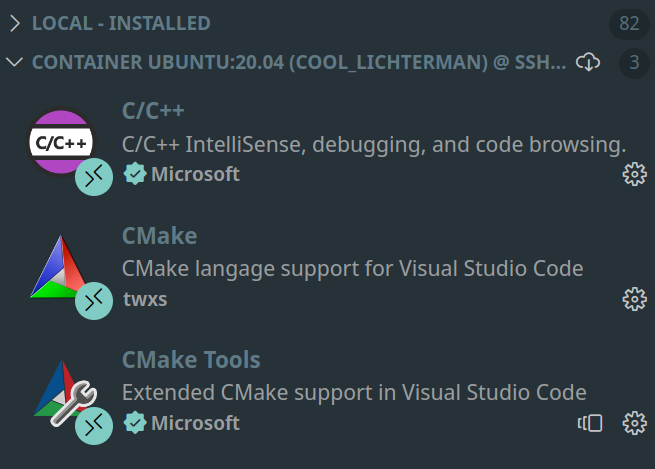
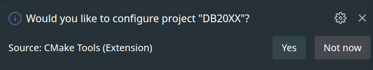

# IDE/Editor的配置

## CLion

如果你选择使用CLion进行开发，那么无需做任何配置，使用CLion打开源代码所在文件夹即可。

## VSCode

- 查看VSCode文档，自行安装
    - 如果你使用VirtualBox一类的虚拟机，安装了带图形界面的Ubuntu，建议将VSCode安装在Ubuntu中
    - 如果你使用WSL，在Windows里安装VSCode然后在VSCode中安装WSL插件
    - 以下默认你是按照上面的方法安装的VSCode
- 打开你的源代码所在的文件夹
    - 虚拟机：直接按`Ctrl+O`打开文件夹
    - WSL：按右下角的Open A Remote Window，选择New WSL Window，然后打开源代码所在文件夹

        
- 安装插件: `C/C++`、`CMake`、`CMake Tools`，如果你使用WSL开发，千万注意插件不是装在LOCAL里，一定要在WSL里

        

- 安装完成以后右下角会弹出提示框(如果没有弹出尝试重新打开文件夹)
        
        
    - 选择Yes，然后弹出选项框选Unspecified
